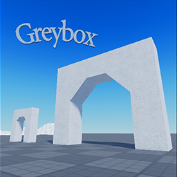

# Greybox

Greybox is a [Roblox](https://www.roblox.com/create) boilerplate game.

* A textured building set useful for prototyping level geometry
* Environment is based on the [Baseplate 2021](https://devforum.roblox.com/t/1127446) template
* A variety of useful [modules](Greybox/ReplicatedStorage/Modules), including Event, Binder, Maid, [Promise](https://github.com/evaera/roblox-lua-promise), State Machine, and other object-oriented goodies
* A basic setup for [Cmdr](https://github.com/evaera/Cmdr) pre-installed

## Development

Greybox is built using [Rojo 6](https://github.com/rojo-rbx/rojo). Also included is a [Makefile](Makefile) to be used with [GNU make](https://www.gnu.org/software/make/).
